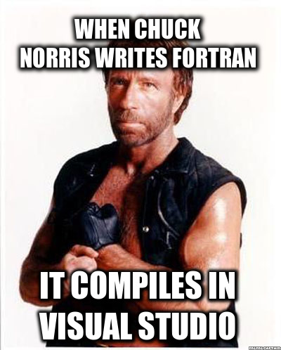

# Witaj w kursie podstaw programowania w języku C++!

Kody źródłowe znajdują się w [repozytorium Bitbucket](https://bitbucket.org/akastrau/korepetycje-c).

!!! tip "Wskazówka"
    Odnośnik do repozytorium znajduje się także w prawym górnym rogu menu.

## Słowo na niedzielę... czyli krótki wstęp
### O czym będzie ten kurs
Materiały umieszczone na tej stronie są elementami pomocniczymi do nauki języka C++. Wszystkie inne aspekty omówione będą na zajęciach. Nie będę za bardzo wnikał w teorie (jednak niektóre elementy krótko opisze).

Kurs będzie na bieżąco zmieniany. Część ćwiczeń będą umieszczone w repozytorium. Materiały o których wspomniałem mają postać mini ściągawki (warto zapoznać się z nimi przed zajęciami).

### O czym nie będzie ten kurs
Nie będziemy zajmować się tematyką algorytmów (jest wiele ciekawych pozycji już na ten temat). Nie będziemy także skupiać się tak bardzo na metodykach wytwarzania oprogramowania (bo tym zajmuję się inżyneria oprogramowania).

### Struktura kursu
Kurs podzieliłem na dwie zasadnicze części. Pierwsza bardzo ważna omawia programowanie proceduralne w języku C. Druga zaś będzie opisywać programowanie zorientowane obiektowo, czyli pewne podejście wykorzystywane w wielu systemach informatycznych.

W pierwszej części nie zabraknie podstawowych aspektów programowania (podstawowe typy i struktury danych). Pokaże w niej także w jaki sposób sterować działaniem programu (z ang. control flow). Do tego wszystkiego nauczymy się korzystać z dobrodziejstw debuggera.

Następnie wejdziemy w świat programowania zorietowanego obiektowo. Poznamy różnice między programowaniem proceduralnym i obiektowym. Nauczymy się modelować programy w podejściu obiektowym.

### Dlaczego język C?
Zaczynamy od tego języka z kilku powodów:

+ Jest prostszy w swojej strukturze (brak złożonych obiektów), 
+ Biblioteka standardowa jest mała (jeśli chodzi o ilość funkcji w porównaniu do języka C++),
+ Nauczymy się operować na wskaźnikach (pozwoli nam to zrozumieć pewne mechanizmy istniejące w jezykach bazujących na języku C),
+ Daje nam dostęp bezpośrednio do pamięci RAM (niżej jest tylko język Asembler).

Źródło: https://comm2302metafiction.wordpress.com/2012/10/03/the-equal-dilemma/

To wszystko pozwoli nam na płynne przejście do C++.

### Źródła wiedzy (polecane przeze mnie)
Czytanie dokumentacji to bardzo ważna umiejętność! Dlatego polecam używać dokumentacji z przykładami.
Na co dzień korzystam z dokumentacji z portalu [cplusplus.com](http://www.cplusplus.com/reference/). Można tam znaleźć tutorale dotyczące języka C i C++. Drugą stroną, który kazdy programista powinien znać to [Stack Overflow](stackoverflow.com).

<image src="img/stackoverflow.jpg" alt="Stack Overflow" width="50%" height="50%">

Źródło: imgur.com

### Z jakiego IDE polecam korzystać
IDE to środowisko programistyczne którego w skład wchodzą:

+ kompilator
+ linker
+ debugger
+ i najczęściej inne narzędzia pomagające w pisaniu kodu.

Na zajęciach bedziemy korzystać z Visual Studio 2017 (wersja community - do pobrania za darmo).

Źródło: http://i.memecaptain.com/gend_images/loHMIw.jpg

### System kontroli wersji
Na zajęciach będziemy korzystać z systemów kontroli wersji opartych o technologie Git. Wszystkie instrukcje co do konfiguracji środowiska będą/zostały omówione na zajęciach.

# Algorytmy + struktury danych = programy
> Książka napisana przez Niklausa Wirtha świetnie ukazująca istote algorytmów i struktur danych.