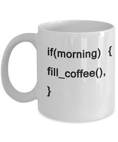

# Lekcja 2: kilka słów o pętlach i operacjach wejścia i wyjścia

W poprzedniej lekcji poznaliśmy podstawowe typy danych oraz funkcje `printf()`. W tej lekcji zajmiemy się kontrolą wykonania naszego kodu.

## Przykład 1
Zerknijmy na poniższy kod:

``` c
#include <stdio.h>
#include <stdlib.h>

int main()
{
	char name[35];
	char myName[] = "Alice"; // char myName[] = {'A', 'l', 'i', 'c', 'e'}; lub char* myName = "Alice";
	int age = 0;
	printf("Hi, I'm %s! What's your name?: ", myName);
	scanf("%s", name);

	printf("Hi %s! How old are you? ", name);
	scanf("%i", &age);

	if (age < 18)
	{
		printf("This content is not available for you! Sorry, dude!\n");
		printf("Returning -1!\n");
		system("pause");
		return -1;
	}
	else 
	{
		printf("Ok, You're in!\n");
	}
	
	system("pause");
	return 0;
}

```

W pierwszych liniach funkcji main zadeklarowaliśmy tablice (pierwsza pusta o rozmiarze maksymalnym 35 znaków i druga zawierająca napis "Alice"). Kazda tablica typu char powinna być zakończona znakiem '\0' (null-terminated string). Znak null zostanie dodany automatycznie w naszym przypadku.

Dalej nie dzieje, się nic szczególnego. Zwróćmy jednak uwage na funkcje `scanf()`. Jest to funkcja podobna do funkcji `printf()`. Jej zadaniem jest wczytanie danych z klawiatury, następnie umieścić je w odpowiednim miejscu. Miejsce te definiowane jest przez **wskaźnik**. Wskaźnik zawiera adres w pamięci RAM danej zmiennej (wskazuje na zmienną).

Tablice typu char są automatycznie wskaźnikami. Wskaźnik domyślnie wskazuje na pierwszy element w tablicy.

Funkcja  `scanf()` przyjmuje format danych, który ma zostać wczytany z klawiatury (tak jak w funkcji `printf()`), a następnie podaje się zmienne w postaci wskaźnikowego, czyli adresy.

W postaci zmiennych niewskaźnikowych robimy to za pomocą operatora `&` (przykład: `&x` -> dostaniemy adres zmiennej x w pamięci).

W przypadku zmiennych, które są wskaźnikami, przekazujemy wartość tak jak zwykle.

Potem widzimy blok `if (warunek) {...} else {...}`. Kod pod warunkiem **if** zostanie wykonany, jeśli wartość logiczna warunku da wartość true (inaczej 1). W naszym wypadku jest to wiek mniejszy od 18 lat.

Kod w bloku else zostanie wykonany w innym przypadku.

Niestety funkcja scanf() jest niebezpieczna. Jednym z zamienników jest funkcja `scanf_s()` dostępna jedynie w systemach Windows. O innych zamiennikach opowiem w innej lekcji. W VS Studio możemy wyłączyć sprawdzanie bezpieczeństwa kodu poprzez wyłączenie **SDL checks** w ustawieniach projektu.


## Przykład 2

``` c
#include <stdio.h>
#include <stdlib.h>
#include <string.h>

int main()
{
	char answer[4] = { 0 };
	while (1) {
		printf("Do you know Elizabeth Turner? [yes, no, idk]: ");
		scanf_s("%s", answer, 4);

		if (strcmp(answer, "yes") == 0)
		{
			printf("Great!\n");
			break;
		}
		else if (strcmp(answer, "no") == 0) {
			printf("Elizabeth is an actress!\n");
			break;
		}
		else if (strcmp(answer, "idk") == 0) {
			printf("Really!? I'm not sure if you are just stupid or you're trolling!\n");
			break;
		}
		else {
			printf("Do you know Elizabeth Turner? [yes, no, idk]: ");
			scanf_s("%s", answer, 4);
		}
	}
	
	system("pause");
	return 0;
}
```

W tym przykładzie użyliśmy biblioteki `<string.h>` do porównywania zmiennych łańcuchowych. Funkcja `strcmpy()` porównuje dwa wskaźniki typu char i zwraca różnicę w znakach. Jeśli oba stringi są identyczne to funkcja `strcmp()` zwróci `0`.

!!! tip "Ciekawostka"
	Istnieje funkcja `strcmpi()`, która nie zwraca uwagę na wielkość liter przy porównywaniu.

	Inną ciekawą funkcją jest `strlen()`, która zwraca aktualną długość tablicy znaków.

!!! Warning "Uwaga!"
	Funkcja `scanf_s()` wymaga podania jeszcze jednego argumentu, w przypadku tekstu. Jest to maksymalna ilość znaków jakie mogą byc zapisane w zmiennej typu char*.


## Przykład 3

``` c
#include <stdio.h>
#include <stdlib.h>
#include <stdbool.h>

int main()
{
	bool doIt = false;
	int counter = 0;

	do
	{
		printf("Do it? ");
		doIt == true ? printf("Yes!\n") : printf("No!\n");
		counter++;
	} while (doIt);
	printf("Counter: %i\n", counter);

	while (doIt == 1) // doIt == true
	{
		printf("Incrementing counter in while loop!\n");
		counter++;
	}
	printf("Counter: %i\n", counter);
	doIt = 1;
	printf("Do it? ");
	doIt == true ? printf("Yes!\n") : printf("No!\n");
	while (doIt == true && counter < 3)
	{
		printf("Incrementing counter in while loop (another loop)!\n");
		counter += 1; // counter++; lub counter = counter + 1;
	}

	system("pause");
	return 0;
}

```

W tym przykładzie użyliśmy biblioteki `<stdbool.h>`, żeby móc zdefiniowac typ zmiennej typu bool (typu logicznego). Typ logiczny może przyjmować dwie wartości: **true** albo **false** (1 albo 0).

Do kontrolowania przepływu działania użyliśmy `do {...} while(warunek)` (wykonaj najperw operacje pod `do`, potem sprawdź, czy warunek jest prawdziwy. Jeśli tak, to powtórz operacje). W konstrukcji `while(warunek)` warunek najpierw jest sprawdzany. Jeśli jest on prawdziwy, to kod zostanie wykonany.

Kod `counter++` inkrementuje (zwiększa wartość) zmienną `counter` o 1. Z kolei `doIt == true : operacja ? druga_operacja` to tzw. skrócony if.

Konstrukcja skróconego if'a wygląda tak:

`warunek : (jesli prawdziwy wykonaj operacje) ? (wykonaj, jeśli fałsz)`

Jest to równoważne z:

``` c
if (warunek){
	// wykonaj operacje, jeśli prawdziwy
} else {
	// wykonaj, jeśli fałsz
}
```

`&&` oznacza i logiczne (koniunkcja), `||` - lub logiczne (alternatywa), a `!` - zaprzeczenie (negacje).

<center></center>
<center>Źródło: https://pl.pinterest.com/pin/382735668317221447/</center>

## Przykład 4

``` c
#include <stdio.h>
#include <stdlib.h>

int main()
{
	int sum = 0;
	int n = 10;
	for (int i = 1; i <= n; i++)
	{
		sum += i;
	}
	printf("Sum: %i\n", sum);
	sum = n * (n + 1) / 2;
	printf("Sum: %i\n", sum);

	system("pause");
	return 0;
}
```

W tym przykładzie zaprezentowałem użycie pętli `for`. Pętla ta oblicza sumę od 1 do n.

Konstrukcja pętli wygląda następująco:

``` c
for (int zmienna = wartosc_od_ktorej_zaczynamy, warunek, krok){
	// kod
}
```

Kod zostanie wykonywany tak długo, jak zmienna `i` nie osiągnie wartość `n`. Zmienna `i` zwiększana jest o 1 (to jest nasz krok).

Zachęcam do sprawdzenia działania tego kodu (i nie tylko tego!).

## Przykład 5

W tym przykładzie użyliśmy konstrukcji `switch(zmienna_liczbowa){case warunek}`. Posłużyła ona nam do zbudowania prostego menu.

``` c
#include <stdio.h>
#include <stdlib.h>

int main()
{
	int mode = -1;
	printf("\tNuclear Weapon control panel! Welcome!\n\n");
	printf("Select mode:\n 1 - destroy USA\n 2 - Clean weapon\n 3 - Prepare nuclear energy\n\n");
	printf("Selection> ");
	scanf_s("%i", &mode);


	switch (mode)
	{
	case 1:
		printf("Launching nuclear missiles!\n");
		break;
	case 2:
		printf("Cleaning...\n");
	case 3:
		printf("Preparing...\n");
		break;
	default:
		printf("Bad mode!\n");
		break;
	}

	system("pause");
	return 0;
}
```

Niestety konstrukcja `switch()...case` wymaga użycia zmiennej liczbowej (lub znaku, bo znak to też liczba). Specjalnie przy drugim case nie użyłem słówka kluczowego `break`. Sprawdź koniecznie działanie programu z `break` i bez!

## A teraz na zakończenie... praca domowa!


<center></center>
<center>Źródło: https://www.redbubble.com/people/fayafshar/works/8585516-keep-calm-and-code?p=t-shirt</center>

W repozytorium znajdziesz solucję o nazwie **homework02-task01**.

W solucji znajdziemy lekko zmodyfikowany kod zaprezentowany w drugim przykładzie. Wygląda on następująco:

``` c
#include <stdio.h>
#include <stdlib.h>

int main()
{
	// Implement data validation!
	// Age must be an integer in range <0;150>
	// What happens if you cause a buffer overflow (that is to say that, you enter a character string larger than 35 characters)?
	// Force may be with you! Good luck!

	char name[35] = { 0 };
	char myName[] = "Alice"; // char myName[] = {'A', 'l', 'i', 'c', 'e'}; lub char* myName = "Alice";
	int age = 0;
	printf("Hi, I'm %s! What's your name?: ", myName);
	scanf_s("%s", name, sizeof(name));

	printf("Hi %s! How old are you? ", name);
	scanf_s("%i", &age);
	

	if (age < 18)
	{
		printf("This content is not available for you! Sorry, dude!\n");
		printf("Returning -1!\n");
		system("pause");
		return -1;
	}
	else if (age > 150)
	{
		printf("YYyhmm??\n");
		return 0x029A;
	}
	else
	{
		printf("Ok, You're in!\n");
	}

	system("pause");
	return 0;
}
```

Tak jak opisałem wyżej, należy zaimplementować walidacje wprowadzanych danych. Nie można dopuścić do sytuacji takiej, że użytkownik wprowadza wiek większy od 150 lat i mniejszy od 0. Zwróć uwagę, że w takiej sytuacji fragment ``else if...`` jest zbędny.

W przypadku podania błędnych danych, użytkownik proszony jest o ich ponowne wprowadzanie tak długo, aż wpisze je poprawnie. :)

Pamiętaj także o czyszczeniu bufora wejściowego ``stdin``. **POWODZENIA!**